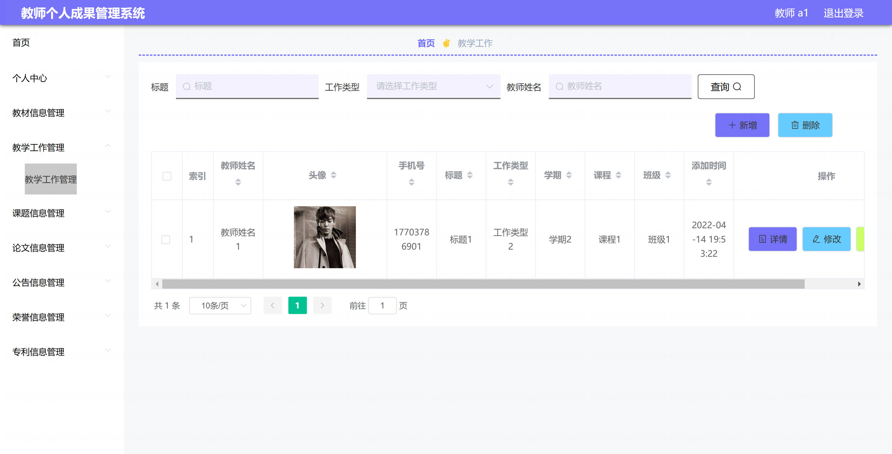

基于Springboot的教师个人成果管理系统（程序+论文）
=

### 完整代码获取地址：从戎源码网 ([https://armycodes.com/](https://armycodes.com/))
### 作者微信：19941326836  QQ：952045282 
### 承接计算机毕业设计、Java毕业设计、Python毕业设计、深度学习、机器学习
### 选题+开题报告+任务书+程序定制+安装调试+论文+答辩ppt 一条龙服务
### 所有选题地址https://github.com/nature924/allProject

一、项目介绍
---
基于 Spring Boot + Vue 的教师个人成果管理系统，系统角色为：系统管理员、教师，主要功能如下

管理员：
基本操作：登录、修改密码、获取/修改个人信息、登出。
用户管理：用户列表/详情/新增/修改/删除、重置密码、注册审核与会话管理
成果与内容管理：对所有成果模块（教材、教学工作、课题、论文、专利、荣誉等）的全面 CRUD、模板下载。
公告管理：公告发布/修改/删除/查询（/news）。
文件管理：上传/下载附件、
审核与统计：修改审核状态

教师（普通用户）：
基本操作：登录、修改密码、获取/修改个人信息、登出。
本人成果管理：对自己所属的成果记录进行新增/编辑/删除/查看
公告与通知：查看公告列表与详情。
文件操作：上传附件（用于成果/个人资料）、下载模板

二、项目技术
---
- 编程语言：Java
- 数据库：MySQL
- 项目管理工具：Maven
- 前端技术：VUE、HTML、Jquery、Bootstrap
- 后端技术：Spring、SpringMVC、MyBatis

三、运行环境
---
- 操作系统：Windows、macOS都可以
- JDK版本：JDK1.8以上都可以
- 开发工具：IDEA、Ecplise、Myecplise都可以
- 数据库: MySQL5.7以上都可以
- Tomcat：任意版本都可以
- Maven：任意版本都可以

四、运行截图
---
### 论文截图：

### 程序截图：

